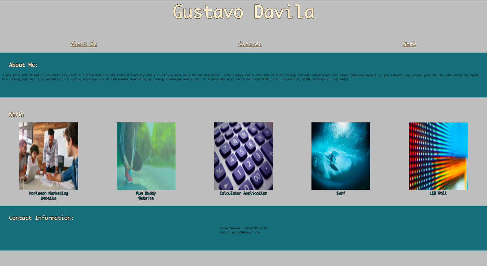

Gustavo's Portfolio 

Description:
This project is a deployed URL that includes my (Gustavo's) portfolio with 3 important criteria: 
-About me:
Details specific details about my life and how I was introduced into coding and what my goals are for the bootcamp. 
-Work:
Includes pictures that are linked to URLs of applications made with the bootcamp. Like the Horiseon refractor challenge and the Run Buddy work from the modules. 
-Contact:
Includes my personal phone number and email address.

*Please note some links in the works section do not lead to anything because as the assignment instructions asked I included future work that will be linked in the future.

URL:
gdav24.github.io/gustavo-portfolio

Screenshot of portfolio:

